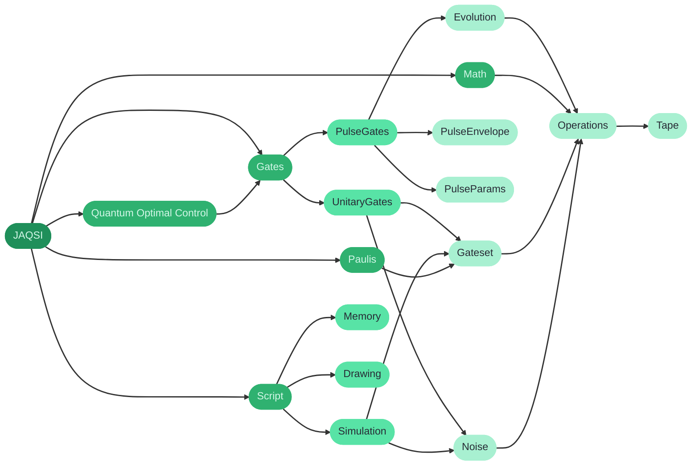

# JAQSI

<p align="center">

</p>
<h3 align="center">Just another quantum simulator.</h3>
<br/>

## 📜 About

JAQSI is a gate- and pulse-level quantum circuit simulator built on JAX.\
Circuits are plain Python functions that record operations onto a tape; the `Script` class compiles and executes them, routing between statevector and density-matrix simulation automatically depending on whether noise channels are present.
Everything is pure JAX, so circuits are differentiable, `jit`-able and `vmap`-able out of the box.

Beyond gate-level simulation, JAQSI simulates circuits at the pulse level by integrating the time-dependent Hamiltonian of each gate, and ships a quantum optimal control module to tune pulse parameters against target unitaries.

## 🚀 Getting Started

```
pip install jaqsi
```

to install our package from [PyPI](https://pypi.org/project/jaqsi/).

For NVIDIA GPUs install the CUDA extra

```
pip install "jaqsi[cuda13]" # or cuda13 depending on your hardware
```

JAX then runs on the GPU by default; set `JAX_PLATFORMS=cpu` to force the CPU.

```python
import jaqsi

def circuit(theta):
    jaqsi.Gates.RX(theta[0], wires=0)
    jaqsi.Gates.CX(wires=[0, 1])

script = jaqsi.Script(circuit, n_qubits=2)
script.execute(type="expval", obs=[jaqsi.PauliZ(wires=0)], args=(theta,))
```

You can find details on how to use it and further documentation on the corresponding [Github Page](https://cirkiters.github.io/jaqsi/).

Looking for quantum Fourier model tooling (ansaetze, expressibility, entangling capability, Fourier analysis) built on top of this simulator? 
See [qml-essentials](https://github.com/cirKITers/qml-essentials).

## 📦 Package Structure

The following diagram provides an overview on how the different components within this package depend on each other.
`Gates` is the entry point for applying gates to a circuit and `Script` the one for executing it; everything below them is the machinery they dispatch to.



## 🚧 Contributing

Contributions are highly welcome! 🤗 Take a look at our [Contribution Guidelines](https://github.com/cirKITers/jaqsi/blob/main/CONTRIBUTING.md).

See our [coverage report](coverage/index.html) if you would like to contribute with further tests.
