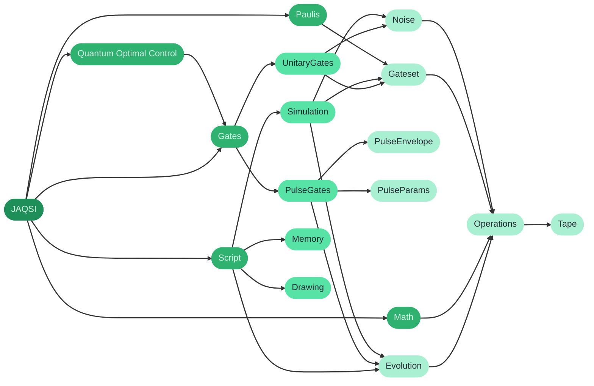

# JAQSI

<p align="center">

</p>
<h3 align="center">Just another quantum simulator.</h3>
<br/>

## 📜 About

JAQSI is a JAX-based quantum circuit simulator for gates and pulses. Write a circuit as a Python function, then let JAQSI take care of the simulation.
The function records operations; `Script` executes them with statevector or density-matrix simulation, depending on whether they contain noise.
Circuits support JAX differentiation, `jit`, and `vmap`.

At the pulse level, JAQSI integrates each gate's time-dependent Hamiltonian. Its quantum optimal control module tunes pulse parameters against target unitaries.

## 🚀 Getting Started

```sh
pip install jaqsi
```

For NVIDIA GPUs, install the appropriate CUDA extra:

```
pip install "jaqsi[cuda13]" # use cuda12 if needed
```

The [pulse guide](docs/pulses.md) has a few device tips for GPU runs.

```python
import jaqsi
import jax.numpy as jnp

def circuit(theta):
    jaqsi.Gates.RX(theta[0], wires=0)
    jaqsi.Gates.CX(wires=[0, 1])

script = jaqsi.Script(circuit, n_qubits=2)
theta = jnp.array([0.5])
script.execute(type="expval", obs=[jaqsi.PauliZ(wires=0)], args=(theta,))
```

That is a complete circuit. The [documentation](https://cirkiters.github.io/jaqsi/) has more examples to try.

For quantum Fourier models, [qml-essentials](https://github.com/cirKITers/qml-essentials) builds on JAQSI and provides ansätze, expressibility, entangling capability, and Fourier analysis tools.

## 📦 Package Structure

Here is how the pieces fit together. `Gates` applies gates; `Script` executes circuits.


```mermaid
flowchart LR
    jaqsi([JAQSI])
    jaqsi --> jaqsi.gates([Gates])
    jaqsi --> jaqsi.script([Script])
    jaqsi --> jaqsi.qoc([Quantum Optimal Control])
    jaqsi --> jaqsi.math([Math])
    jaqsi --> jaqsi.paulis([Paulis])

    jaqsi.gates --> jaqsi.unitary([UnitaryGates])
    jaqsi.gates --> jaqsi.pulse([PulseGates])
    jaqsi.qoc --> jaqsi.gates

    jaqsi.script --> jaqsi.simulation([Simulation])
    jaqsi.script --> jaqsi.memory([Memory])
    jaqsi.script --> jaqsi.evolution([Evolution])
    jaqsi.script --> jaqsi.drawing([Drawing])

    jaqsi.pulse --> jaqsi.evolution
    jaqsi.pulse --> jaqsi.envelope([PulseEnvelope])
    jaqsi.pulse --> jaqsi.pparams([PulseParams])

    jaqsi.unitary --> jaqsi.gateset([Gateset])
    jaqsi.unitary --> jaqsi.noise([Noise])
    jaqsi.simulation --> jaqsi.gateset
    jaqsi.simulation --> jaqsi.noise
    jaqsi.simulation --> jaqsi.evolution
    jaqsi.paulis --> jaqsi.gateset
    jaqsi.evolution --> jaqsi.ops([Operations])
    jaqsi.math --> jaqsi.ops

    jaqsi.gateset --> jaqsi.ops
    jaqsi.noise --> jaqsi.ops
    jaqsi.ops --> jaqsi.tape([Tape])

    classDef l1 fill:#1f8f5a,stroke:#1f8f5a,color:#d4f7e8
    classDef l2 fill:#2fb170,stroke:#2fb170,color:#d4f7e8
    classDef l3 fill:#58e3a6,stroke:#58e3a6,color:#272a35
    classDef l4 fill:#a8f0d1,stroke:#a8f0d1,color:#272a35

    linkStyle default stroke-width:2px

    class jaqsi l1
    class jaqsi.gates,jaqsi.script,jaqsi.qoc,jaqsi.math,jaqsi.paulis l2
    class jaqsi.unitary,jaqsi.pulse,jaqsi.simulation,jaqsi.memory,jaqsi.drawing l3
    class jaqsi.gateset,jaqsi.noise,jaqsi.ops,jaqsi.tape,jaqsi.evolution,jaqsi.envelope,jaqsi.pparams l4
```

## 🚧 Contributing

Contributions are welcome! See the [contribution guidelines](CONTRIBUTING.md) to get involved.

The [coverage report](coverage/index.html) is a handy place to look for tests to add.
