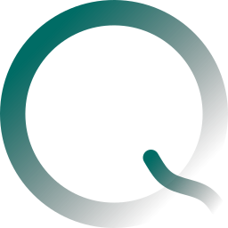

#

<p align="center">

</p>
<h3 align="center">Just another quantum simulator.</h3>
<br/>

JAQSI is a gate- and pulse-level quantum circuit simulator built on JAX.
Circuits are plain Python functions that record operations onto a tape; the `Script` class compiles and executes them, routing between statevector and density-matrix simulation automatically depending on whether noise channels are present.
Everything is pure JAX, so circuits are differentiable, `jit`-able and `vmap`-able out of the box.

Curious? :eyes: Installing this package is as simple as with any other package :rocket:

```
pip install jaqsi
```
or with the [uv package manager](https://github.com/astral-sh/uv):
```
uv add jaqsi
```

Once you have set things up, go ahead and checkout [how to use JAQSI](usage.md).

```python
import jaqsi
from jaqsi import Gates

def circuit(theta):
    Gates.RX(theta[0], wires=0)
    Gates.CX(wires=[0, 1])

script = jaqsi.Script(circuit, n_qubits=2)
script.execute(type="expval", obs=[jaqsi.PauliZ(wires=0)], args=(theta,))
```

`Gates` is the entry point for applying gates: it records them on the circuit tape, attaches
any noise you ask for, and runs them as ideal unitaries or, with `pulse=True`, as real pulses.

Beyond gate-level simulation, JAQSI can simulate circuits at the [pulse level](pulses.md) and tune pulse parameters with [quantum optimal control](references.md#quantum-optimal-control).

If you are looking for quantum Fourier model tooling built on top of this simulator (ansaetze, expressibility, entangling capability and Fourier analysis), see [qml-essentials](https://github.com/cirKITers/qml-essentials).

If you want to contribute, please refer to our [CONTRIBUTING guide](https://github.com/cirKITers/jaqsi/blob/main/CONTRIBUTING.md) on Github.

Do you want to use our software in a research project? :books:
Please checkout the [github repository](https://github.com/cirKITers/jaqsi) and follow the instructions ("Cite this repository") there.
