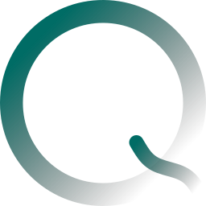

#

<p align="center">

</p>
<h3 align="center">Just another quantum simulator.</h3>
<br/>

JAQSI is a JAX-based quantum circuit simulator for gates and pulses.
Circuits are Python functions that record operations; `Script` executes them with statevector or density-matrix simulation, depending on whether they contain noise.
Circuits support JAX differentiation, `jit`, and `vmap`.

To give it a try, install JAQSI with pip:

```
pip install jaqsi
```

For NVIDIA GPUs, install the appropriate CUDA extra:

```
pip install "jaqsi[cuda13]" # use cuda12 if needed
```

Once installed, define a circuit as a Python function. `Gates` records its operations, and `Script` executes it and returns the requested measurement. Here is a small one to start with; the [usage guide](usage.md) takes it further.

```python
import jaqsi
import jax.numpy as jnp
from jaqsi import Gates

def circuit(theta):
    Gates.RX(theta[0], wires=0)
    Gates.CX(wires=[0, 1])

script = jaqsi.Script(circuit, n_qubits=2)
theta = jnp.array([0.5])
script.execute(type="expval", obs=[jaqsi.PauliZ(wires=0)], args=(theta,))
```

`Gates` records gates and optional noise on the circuit tape. By default, gates run as ideal unitaries; passing `pulse=True` runs their pulse implementations. The same circuit can use both levels.

To go below the gate level, simulate [pulses](pulses.md) and tune their parameters with [quantum optimal control](references.md#quantum_optimal_control).

For tools built on top of JAQSI, including quantum Fourier model ansätze, expressibility, entangling capability, and Fourier analysis, see [qml-essentials](https://github.com/cirKITers/qml-essentials).

Ideas and bug reports are welcome too; see the [contribution guide](https://github.com/cirKITers/jaqsi/blob/main/CONTRIBUTING.md).

For research citations, use "Cite this repository" on [GitHub](https://github.com/cirKITers/jaqsi).
